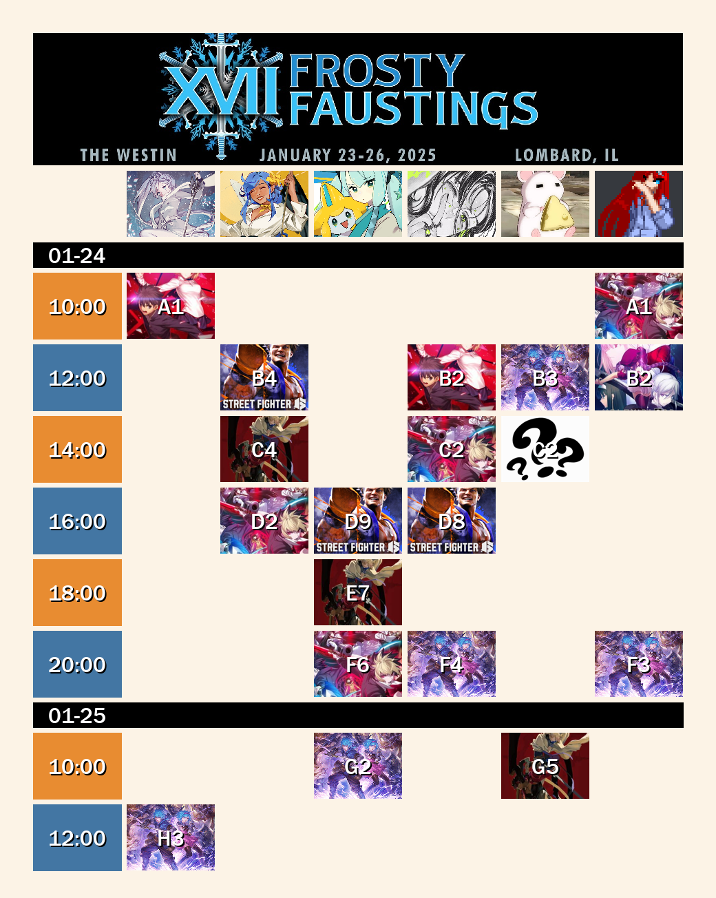

## Installation
You can add the bot to a server using this link: https://discord.com/oauth2/authorize?client_id=1341570437674696834
## Overview
This is a bot that can generate schedule graphics for start.gg events. Add this bot to your server and use the command "/get-schedule" to generate a graphic for all users in your server that have linked their Discord account to their start.gg account.

